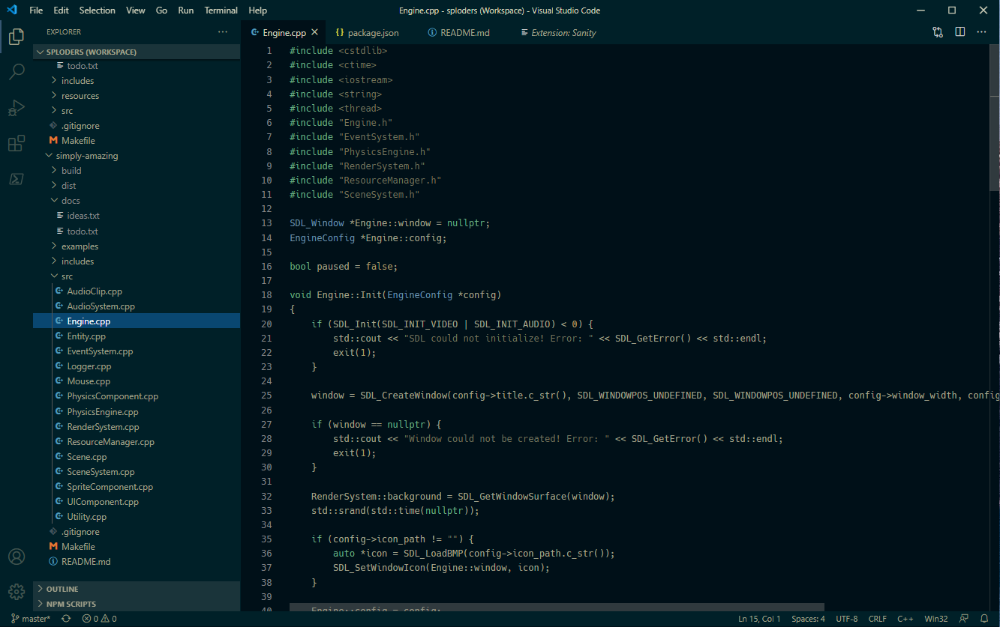

# Sanity

A color theme that won't burn your retinas.

## About

Sanity is a response to my own frustrations that were bred out of a long search for an optimal color theme for VSCode. I must have tried dozens, if not hundreds, of the most popular themes. None of them felt right to me.

In my opinion, most themes suffer from either being too "busy" (amount and contrast of colors), or from being too minimal (hardly any color at all). Themes that are too busy can make the code difficult to *read* deliberately. While themes that are too minimal can make the code difficult to *skim*. Both of which, I think, are important to every programmer.

## Design Philosophy

The overarching philosophy for Sanity is pretty simple: make code easier to read. This philosophy is implemented in Sanity in the following ways...
- Hues shaded to produce colors that optimally contrast (noticably different, but not too violent).
- Minimal number of colors in the palette.
- A neutral and easy to read baseline text color.

## Contributing

If you like the theme, and wish to contribute, by all means feel free to do so! 

The theme is pretty barebones at the moment, and there are parts of it that need some fixing up. Extending support to more languages would be great, also!
